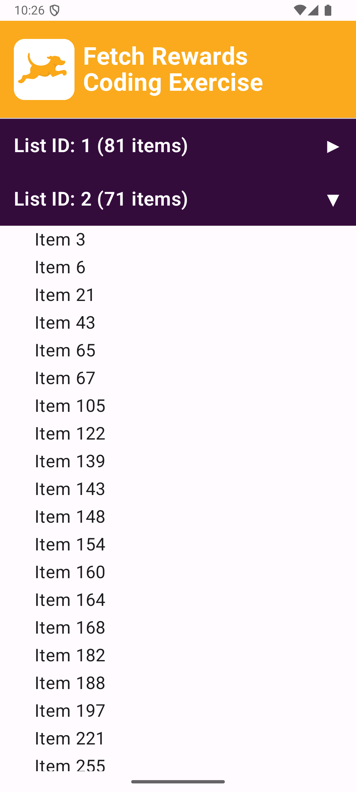
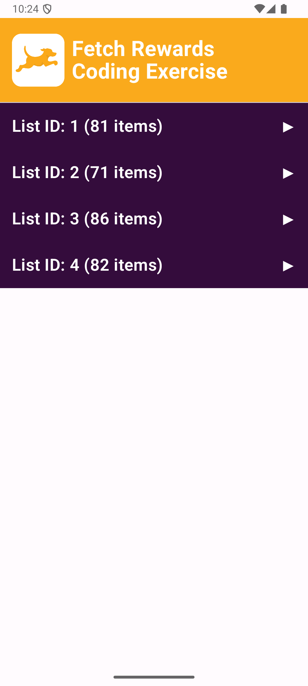

# Fetch Rewards Android Coding Exercise
## By Shonel Rahim

The objective of this exercise is to build a native Android app that organizes data from a JSON file provided in the form of a URL. All the data entries must first be grouped by their `listId` and each group is then sorted by the `name` of the entries.

## Implementation

### Development Environment
- **Android Studio** 2024.2.2 using **Kotlin**
- **Gradle:** 8.9
- **Android Gradle Plugin:** 8.7.3
- **Compile SDK:** 35 
- **Target SDK:** 35 
- **Min SDK:** 24

### Testing Environment
**Tested on:** Medium phone emulator API 35

### Key imports
- **Retrofit:** To make HTTP requests
- **Gson** JSON to Kotlin object conversion
- **Jetpack Compose** UI Framework

### Key files
#### Logic ####
- **MainActivity.kt:** The main screen and the core logic
- **Entry.kt:** Data model for parsing JSON 
- **ApiService.kt:** Interface for API call

#### UI ####
- **Color.kt** - Fetch brand colors 
- **Theme.kt** - applying color scheme
- **Type.kt** - Typography configuration

#### Testing ####
- **DataProcessingTest.kt** - Unit tests covering the data filtering and sorting

## Additional Features
- **Collapsible Grouping:** To make it easier to read I've made each grouping a collapsible list. 
- **Logo On-Click Collapse/Expand:** The display opens with all the groups expanded, pressing the logo will collapse/expand all groups.

 Expanded Section | Collapsed Section |
|-------------------|-------------------|
|  |  |

## Thank you for your time!
